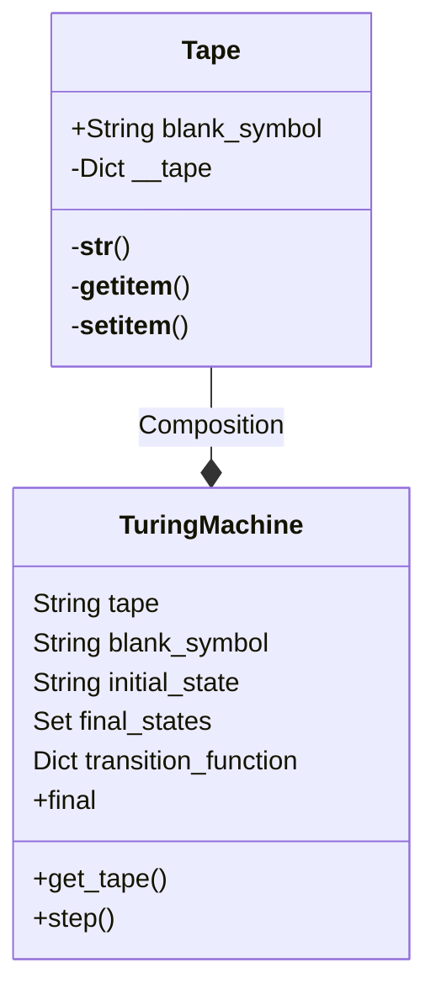

```mermaid
classDiagram

Tape --* TuringMachine : Composition
class Tape{
	+String blank_symbol
	-Dict __tape
	-__str__()
	-__getitem__()
	-__setitem__()
}
class TuringMachine{
	String tape
	String blank_symbol
	String initial_state
	Set final_states
	Dict transition_function
	+get_tape()
	+step()
	+final
}

```

